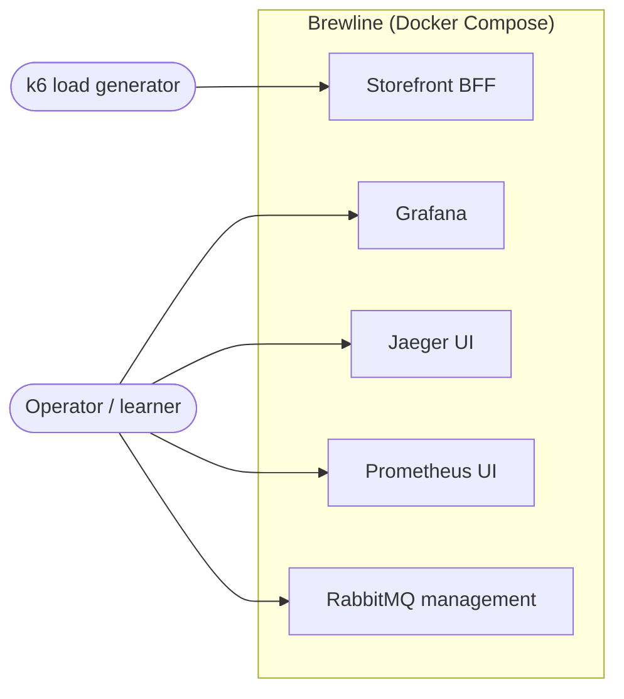
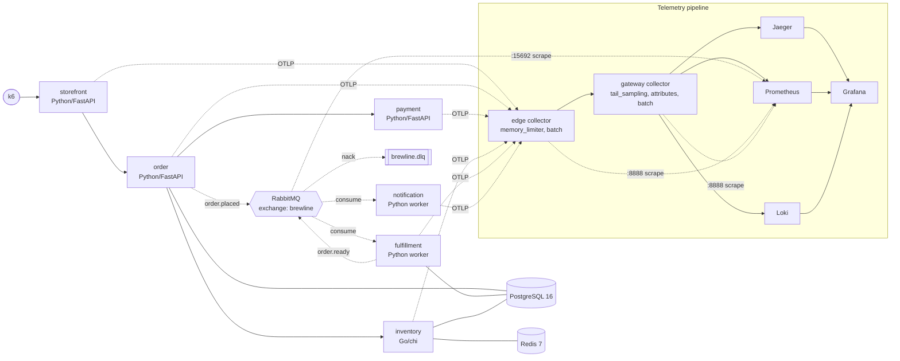
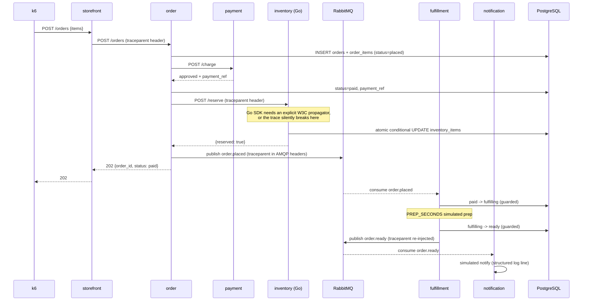
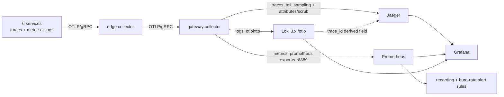
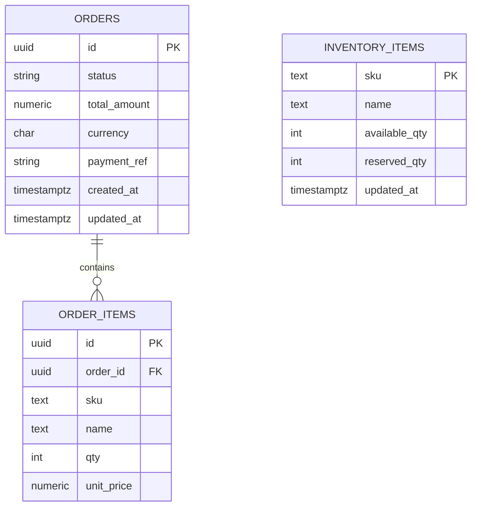
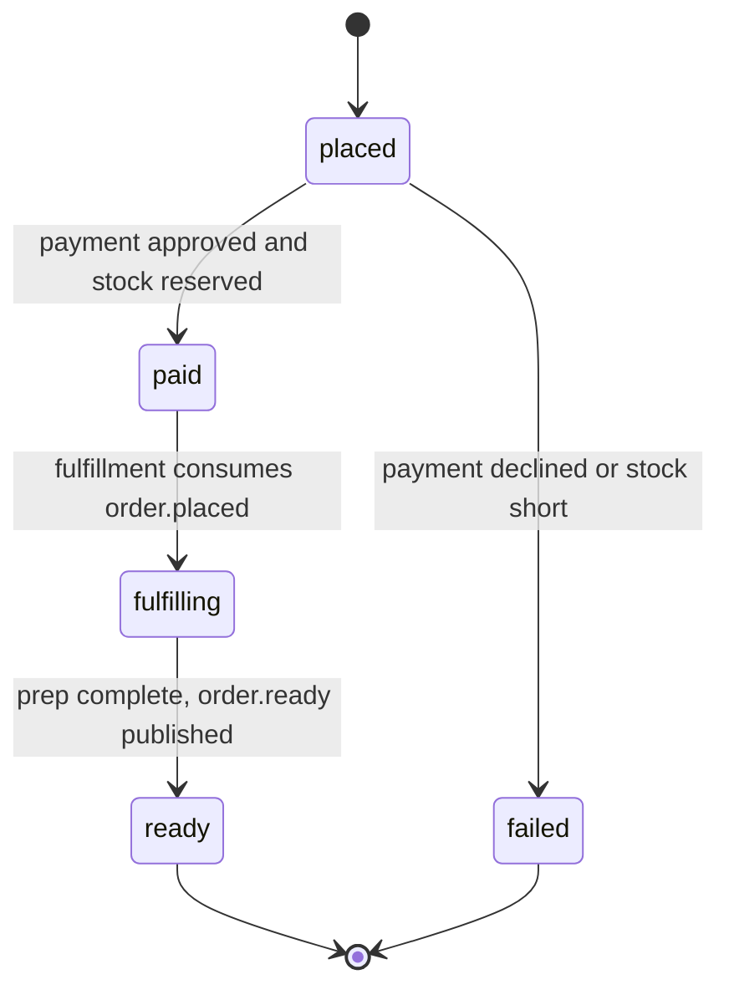

# Brewline — Architecture

The current picture of the system as built. Diagrams first, reasoning at the bottom.

Brewline is a coffee-order backend that exists to be a teaching rig for OpenTelemetry: one
`POST /orders` becomes one distributed trace crossing synchronous HTTP *and* an asynchronous
broker, with metrics, logs, SLOs, and four deliberate-failure experiments on top.

## System context

Who talks to the system from outside the compose network.

## Components

The six services, their datastores, and the telemetry pipeline they all feed.

Solid edges are synchronous HTTP, where W3C `traceparent` propagates automatically. Dashed broker
edges carry trace context only because it is injected into and extracted from AMQP headers by hand.

## Key flow — placing an order

One order, end to end, and where the trace would break if context were dropped.

## Key flow — telemetry

Every signal takes the same two-hop path; only the gateway fan-out differs.

## Data model

Three entities, split by owning service. Payment holds no state.

`orders` and `order_items` are owned by the order service (Alembic migrations); `inventory_items`
is owned by the inventory service (seeded by `deploy/db/inventory_init.sql`). `ORDER_ITEMS.sku`
references `INVENTORY_ITEMS.sku` by convention only — there is no cross-service foreign key.

## Order state machine

Only these transitions are legal. Every async transition is a guarded conditional `UPDATE`, so a
redelivered message cannot move an order backward.

## Key Decisions

### 2026-06-21 — No bespoke frontend; the observability stack is the UI

**Status:** Accepted
**Context:** A coffee-ordering demo invites a single-page app. The project's purpose is teaching
OpenTelemetry, and an SPA adds surface area that teaches none of it.
**Decision:** There is no application frontend. The operator-facing surfaces are Grafana, Jaeger,
Prometheus, and the RabbitMQ management UI. Orders are placed by `loadgen/k6_order.js` or `curl`.
**Consequences:** No CORS surface and no browser auth to design. Every user-facing behaviour must be
observable through telemetry, which is the point. A human-facing storefront is out of MVP scope.

### 2026-06-21 — Trace context across the broker is propagated by hand

**Status:** Accepted
**Context:** HTTP hops propagate `traceparent` automatically once instrumented. AMQP does not.
`opentelemetry-instrumentation-aio-pika` can wire simple cases, but the broker boundary is the
single most instructive failure mode in the system.
**Decision:** The order service `inject()`s the current context into AMQP message headers on
publish; fulfillment and notification `extract()` and `attach()` it before starting their spans, and
re-inject on the downstream publish. A `BROKER_PROPAGATION` flag disables this for experiment #1.
**Consequences:** Explicit code on every publish and consume path. A missed inject or extract
fragments the trace silently — no error, just a disconnected waterfall. The flag makes that failure
reproducible on demand.

### 2026-06-21 — Go inventory sets the W3C propagator explicitly

**Status:** Accepted
**Context:** The Go OTel SDK ships a **no-op** text-map propagator by default, unlike Python. The
order → inventory hop would break the trace at the cross-language boundary with no error.
**Decision:** `main` calls `otel.SetTextMapPropagator` with a composite TraceContext + Baggage
propagator, and the chi router is wrapped in `otelhttp.NewHandler`.
**Consequences:** Removing either line reproduces a silent trace break that looks identical to the
broker bug but has a different cause — worth recognising as two distinct failures.

### 2026-06-21 — Tail sampling at a single gateway, `decision_wait` coupled to `PREP_SECONDS`

**Status:** Accepted
**Context:** Head sampling decides before a trace exists, so it cannot preferentially keep errors and
slow traces. Tail sampling can, but only if every span of a trace reaches the same collector, and
only if the decision waits for the whole trace — including the async prep delay.
**Decision:** One gateway instance runs `tail_sampling` with `decision_wait: 15s` against
`PREP_SECONDS=2`: keep 100% of error and >800ms traces, 5% of the rest. The edge collector stays
lightweight (`memory_limiter` first, then `batch`).
**Consequences:** The two values are coupled — raising `PREP_SECONDS` without raising
`decision_wait` persists incomplete traces, a failure that masquerades as a propagation bug. Scaling
past one gateway silently breaks sampling and would require trace-ID-aware routing via the
`loadbalancing` exporter; that is out of MVP scope.

### 2026-06-21 — Identifiers on spans and logs, never on metric labels

**Status:** Accepted
**Context:** `order_id` is the most useful correlation key in the system and the most expensive
possible metric label.
**Decision:** Metric attributes are restricted to bounded-cardinality values (`outcome`, `sku`,
`service.name`). `brewline.order_id` lives on spans and log lines, and the gateway's
`attributes/scrub` deliberately does **not** delete it. `CARDINALITY_MODE=high` violates this on
purpose for experiment #2.
**Consequences:** Log → trace pivots stay possible; Prometheus series count stays bounded. The
escape hatch exists only to demonstrate the failure.

### 2026-06-21 — Queue depth comes from RabbitMQ, not from a worker gauge

**Status:** Accepted
**Context:** A consumer cannot honestly observe its own broker backlog; a worker-side gauge would
report a number the worker made up.
**Decision:** Enable the built-in `rabbitmq_prometheus` plugin on `:15692` and scrape it. Depth
comes from `rabbitmq_queue_messages_ready` / `rabbitmq_queue_messages_unacked`.
**Consequences:** Queue depth is trustworthy enough to drive the SLO dashboard and experiment #3,
at the cost of one more scrape target.

### 2026-06-22 — SLO latency uses a custom histogram, not the HTTP server histogram

**Status:** Accepted
**Context:** `histogram_quantile` needs a `_bucket` series with a boundary at the SLO threshold.
OTel's default histogram does not place one at 800ms, and the auto-configured MeterProvider under
`opentelemetry-instrument` cannot easily take a programmatic View without taking over telemetry
bootstrap.
**Decision:** The order service records a custom `brewline.order.duration` histogram (seconds) with
explicit advisory boundaries including 0.8, around the `POST /orders` handler. Prometheus rules and
the SLO dashboard target `brewline_order_duration_seconds_bucket`.
**Consequences:** The SLI is measured at the order handler — it includes the payment and inventory
calls and excludes the async prep, which is the intended `POST /orders` latency. The series name is
independent of HTTP semantic-convention drift.

### 2026-08-10 — HTTP semantic conventions are pinned by opt-in, not by package version

**Status:** Accepted
**Context:** The RED dashboard queries `http_server_request_duration_seconds_*` and
`http_response_status_code`, which are the *stable* HTTP conventions. Python instrumentation emits
the older millisecond-named series unless told otherwise, so the panels would silently show no data.
The plan called for pinning the instrumentation version; that pins far more than the naming and
cannot be verified without a full image build.
**Decision:** Set `OTEL_SEMCONV_STABILITY_OPT_IN=http` for every service in the compose OTel env
block, and leave the `opentelemetry-*` requirement ranges unpinned.
**Consequences:** Emitted HTTP names are deterministic and match the dashboards. The flag is a no-op
on instrumentation versions that predate it. Dependency ranges stay open, so a future breaking
release is still possible — a version pin remains the stronger option if the stack is ever frozen.

### 2026-08-10 — OTLP log export requires both switches

**Status:** Accepted
**Context:** `OTEL_LOGS_EXPORTER=otlp` selects an exporter but does not attach the SDK logging
handler to the root logger. With only that variable set, records are enriched with `trace_id` and
never shipped — Loki stays empty, which reads as a broken Loki rather than a missing switch.
**Decision:** Compose sets `OTEL_PYTHON_LOGGING_AUTO_INSTRUMENTATION_ENABLED=true` alongside
`OTEL_LOGS_EXPORTER=otlp`, and the README records the pair.
**Consequences:** Logs reach Loki over OTLP with `trace_id` as structured metadata, which is what
the Loki datasource's derived field needs for the log → trace pivot.
