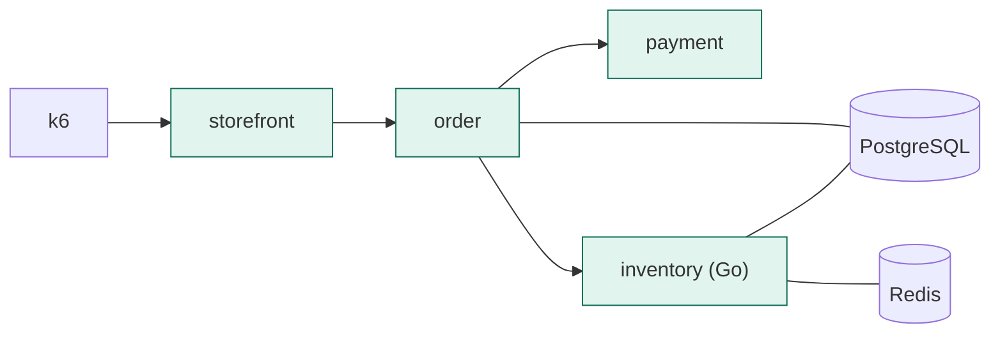

# ITER_01 — Synchronous order flow

## §01 · Concept

> Unchanged — see SKELETON § 01.

## §02 · Architecture

This iteration makes the synchronous half of the flow real. No new entities or routes are introduced — the data model and API surface are exactly as stated in SKELETON § 02; what changes is that handlers now execute real logic against Postgres and Redis instead of returning stubs.



Trace shape after this iteration: one connected waterfall rooted at the storefront `POST /orders` span, with child spans for the order service, its DB writes, and the outbound calls to payment and inventory (including a cross-language hop into the Go inventory service). The async branch does not yet join the trace.

## §03 · Tech Stack

New/confirmed dependencies this iteration:
- order: `sqlalchemy[asyncio]`, `asyncpg`, `alembic` (schema migrations for `orders` / `order_items`).
- inventory (Go): `jackc/pgx/v5`, `redis/go-redis/v9`, `go-chi/chi/v5`.
- Auto-instrumentation packages that actually fire now that real I/O exists: `opentelemetry-instrumentation-{fastapi,httpx,sqlalchemy,asyncpg}` (Python) and `otelhttp` + manual span attributes for `pgx`/`go-redis` (Go).

No version pins are forced yet; the collector/Loki pins arrive in their respective iterations.

## §04 · Backend

**Migrations (order service).** Schema for `orders` and `order_items` is created with Alembic. Gotcha addressed proactively: Alembic defaults to a synchronous driver, but the app uses `asyncpg`. Configure Alembic's `env.py` to build a **synchronous** engine (`postgresql+psycopg://…`) for migrations while the app uses `postgresql+asyncpg://…` at runtime, and ensure every model module is imported in `alembic/env.py` so autogenerate can see the tables (an unimported model is silently invisible). Migrations run as a one-shot `order-migrate` compose service that completes before `order` starts (compose `depends_on: condition: service_completed_successfully`).

**Order identifiers.** `Order.id` and `OrderItem.id` are UUIDs generated in application code (`uuid4()`), not `SELECT MAX(n)+1` — this sidesteps the sequential-ID-under-concurrency race entirely. Inventory's `reserved_qty` updates use `UPDATE … SET reserved_qty = reserved_qty + :n WHERE sku = :sku AND available_qty - reserved_qty >= :n` (a single atomic conditional update), so two concurrent reservations can't oversell.

**Order service `POST /orders`** does, in order: compute total from items → insert `Order` (status `placed`) + `OrderItem` rows in one transaction → call payment `POST /charge` → on `approved`, call inventory `POST /reserve`; set status to `paid` on success, `failed` if payment declines or stock is short, persisting `payment_ref`. (Publishing `order.placed` is added in ITER_02; until then status stops at `paid`.) Request shape `{"items":[{"sku","name","qty","unit_price"}]}`, response `202 {"order_id","status"}`.

```python
# services/order/app/main.py  (sync path; broker publish added in ITER_02)
@app.post("/orders", status_code=202)
async def create_order(body: OrderIn, session: AsyncSession = Depends(get_session)):
    order = Order(id=uuid4(), status="placed",
                  total_amount=sum(Decimal(i.unit_price) * i.qty for i in body.items),
                  currency="USD")
    session.add(order)
    session.add_all([OrderItem(id=uuid4(), order_id=order.id, **i.model_dump()) for i in body.items])
    await session.commit()

    pay = await httpx_client.post(f"{PAYMENT_URL}/charge",
            json={"order_id": str(order.id), "amount": str(order.total_amount), "currency": "USD"})
    pj = pay.json()
    if pj["status"] != "approved":
        await set_status(session, order.id, "failed"); return {"order_id": str(order.id), "status": "failed"}
    order.payment_ref = pj["payment_ref"]

    resv = await httpx_client.post(f"{INVENTORY_URL}/reserve",
            json={"order_id": str(order.id), "items": [{"sku": i.sku, "qty": i.qty} for i in body.items]})
    ok = resv.json()["reserved"]
    await set_status(session, order.id, "paid" if ok else "failed")
    return {"order_id": str(order.id), "status": "paid" if ok else "failed"}
```

**Payment `POST /charge`** is a stateless simulator. For ITER_01 it always approves and returns a generated `payment_ref` (`"pay_" + uuid4().hex[:12]`); the tunable failure rate and latency that make SLOs meaningful are introduced in ITER_03. Defined request shape `{"order_id","amount","currency"}`, response `{"status","payment_ref"}`.

**Inventory `POST /reserve` (Go)** reads each SKU from Redis (`go-redis`), falling back to Postgres on a cache miss and back-filling the cache; applies the atomic conditional `UPDATE` above per item; returns `{"reserved": bool, "shortages": [...]}`. `GET /inventory/{sku}` reads available quantity (cache-first). The inventory table is seeded from `deploy/db/inventory_init.sql` (run by the `inventory-migrate` one-shot, mirroring the order migration pattern) with a handful of SKUs.

**Cross-language propagation gotcha (Go).** The Go SDK ships a **no-op** text-map propagator by default — unlike Python, which defaults to W3C Trace Context. So the order→inventory hop will silently break the trace at the Go boundary unless inventory's `main` sets it explicitly: `otel.SetTextMapPropagator(propagation.NewCompositeTextMapPropagator(propagation.TraceContext{}, propagation.Baggage{}))`. With that set and the handler wrapped in `otelhttp.NewHandler`, the inbound `traceparent` is extracted and inventory's spans attach under the order trace. This is a *silent* failure (no error, just a disconnected trace), so it's wired here rather than discovered later — and it's the same symptom as the broker bug in ITER_02, worth recognizing as a distinct cause.

**Ownership/access control.** Every endpoint serves a single trusted internal caller in the MVP, so there is no per-user authorization; this is recorded as a deliberate deferral (terminator's Out of MVP scope), not an oversight. `GET /orders/{id}` returns `404` for unknown IDs.

**Pagination.** No list endpoints exist yet (`GET /orders/{id}` is single-item), so pagination is not applicable this iteration.

**Middleware order.** Each FastAPI app registers OTel's ASGI instrumentation as the outermost middleware so spans wrap the entire request including any later-added middleware — documented in each `main.py` with a one-line comment, since middleware applies in reverse registration order.

**Cached settings gotcha.** Service settings use a Pydantic `BaseSettings` loaded once at import. A note in each service's README records that tests must override the settings instance in a fixture (not rely on post-import env mutation), which would otherwise capture the wrong `DATABASE_URL`.

New env vars this iteration: none beyond SKELETON (`DATABASE_URL`, `REDIS_URL`, `PAYMENT_URL`, `INVENTORY_URL` now carry real traffic).

## §05 · Frontend

> Unchanged — see SKELETON § 05. (Orders are still driven by `loadgen/k6_order.js` / `curl`; the new real responses now show up as deeper traces in Jaeger, but no operator surface changes.)
