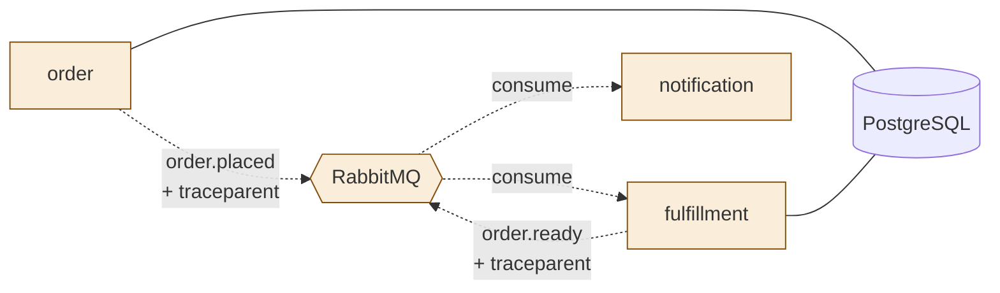

# ITER_02 — Async fulfillment & broker context propagation

## §01 · Concept

> Unchanged — see SKELETON § 01.

## §02 · Architecture

The asynchronous branch becomes real. No new entities. One status-lifecycle change: the order service now advances `paid → fulfilling` when it publishes, the fulfillment worker advances `fulfilling → ready`, and notification reacts to `ready`. No new HTTP routes; the two message types (`order.placed`, `order.ready`) defined in SKELETON § 02 are now actually produced and consumed.



Trace shape after this iteration: the storefront-rooted trace from ITER_01 now **continues across the broker**. The publish in the order service and the consume in fulfillment/notification share one trace because the W3C `traceparent` (and `tracestate`) travel inside the AMQP message headers. This is the central lesson of the whole project — and the place ITER_04's experiment #1 will deliberately break.

## §03 · Tech Stack

> Unchanged — see ITER_01 § 03, plus: `aio-pika` is now exercised on both publish and consume paths, and `opentelemetry-instrumentation-aio-pika` is enabled. Critically, the manual propagation below does **not** rely on that auto-instrumentation alone — see §04 for why context is injected/extracted explicitly.

## §04 · Backend

**Publish with context injection (order service).** After the order is `paid`, the order service publishes `order.placed` to the `brewline` topic exchange. The current span context is serialized into the message headers using OTel's propagator, so the consumer can rejoin the trace:

```python
# services/order/app/broker.py
from opentelemetry.propagate import inject
from opentelemetry import trace

async def publish_order_placed(channel, order_id: str):
    headers: dict = {}
    inject(headers)  # writes traceparent/tracestate into the carrier
    with trace.get_tracer(__name__).start_as_current_span("order.placed publish") as span:
        span.set_attribute("messaging.system", "rabbitmq")
        span.set_attribute("messaging.destination.name", "brewline")
        span.set_attribute("brewline.order_id", order_id)
        await channel.default_exchange.publish(
            aio_pika.Message(body=json.dumps({"order_id": order_id}).encode(), headers=headers),
            routing_key="order.placed")
```

**Consume with context extraction (fulfillment, notification).** Each consumer reconstructs the parent context from the headers and starts its span as a child of it, so the consumer span lands under the original order trace rather than starting a new root:

```python
# services/fulfillment/worker.py
from opentelemetry.propagate import extract
from opentelemetry import context as otel_context, trace

async def on_order_placed(message: aio_pika.IncomingMessage):
    ctx = extract(dict(message.headers or {}))             # rebuild parent context
    token = otel_context.attach(ctx)
    try:
        with trace.get_tracer(__name__).start_as_current_span("fulfillment.process") as span:
            order_id = json.loads(message.body)["order_id"]
            span.set_attribute("brewline.order_id", order_id)
            await advance_status(order_id, "fulfilling")
            await asyncio.sleep(PREP_SECONDS)              # simulate kitchen prep
            await advance_status(order_id, "ready")
            await publish_order_ready(channel, order_id)   # re-injects context for the next hop
        await message.ack()
    finally:
        otel_context.detach(token)
```

Notification's `on_order_ready` mirrors the same extract → attach → span → ack pattern and performs a simulated notify (a structured log line in the MVP; real channels are deferred).

**Why explicit inject/extract even with auto-instrumentation.** The aio-pika auto-instrumentation can wire simple cases, but doing it by hand is the skill being learned here, and it's the only version robust to the broker boundary: the carrier is the AMQP header table, and a single missed `inject`/`extract` is exactly what fragments the trace. ITER_04 turns this on/off via a `BROKER_PROPAGATION` flag so the broken-vs-fixed waterfall can be compared side by side.

**Consumer reliability.** Messages are acked only after the status update and downstream publish succeed (manual ack, `prefetch_count=8`); on exception the message is nacked with requeue once, then dead-lettered to `brewline.dlq` to avoid poison-message loops. This keeps the async path observable rather than silently stuck.

**Idempotency.** `advance_status` is a guarded transition (`UPDATE orders SET status=:next WHERE id=:id AND status=:expected`), so a redelivered message can't move an order backward or double-fire `order.ready`.

No new env vars this iteration (the `RABBITMQ_URL` from SKELETON now carries real traffic; `PREP_SECONDS` is added, **default `2`**). The default is kept small on purpose: the simulated prep delay extends the end-to-end trace duration, and ITER_04's tail sampler must wait for the whole trace before deciding — so `PREP_SECONDS` and the sampler's `decision_wait` are coupled and are pinned together (see ITER_04 § 04).

## §05 · Frontend

> Unchanged — see SKELETON § 05. (The async hops now appear as additional spans on the same Jaeger waterfall, and RabbitMQ's management UI shows real queue depth, but no operator surface is added.)
