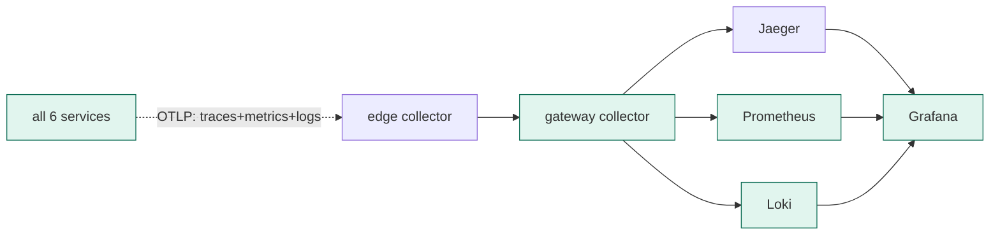

# ITER_03 — Metrics & logs pillars

## §01 · Concept

> Unchanged — see SKELETON § 01.

## §02 · Architecture

Adds the other two telemetry signals on top of the traces already flowing. No new business entities or HTTP routes. The change is in the telemetry pipeline: services now emit metrics and structured logs over OTLP alongside traces, the gateway collector fans them out to Prometheus and Loki, and Grafana visualizes all three.

## §03 · Tech Stack

New/confirmed this iteration:
- Python: `opentelemetry-instrumentation-logging` (injects `trace_id`/`span_id`/`service.name` into log records) plus the SDK metrics API for custom instruments; Go: `go.opentelemetry.io/otel/metric` for the inventory custom metrics.
- Collector exporters pinned now because names/config matter: `prometheus` exporter (gateway exposes a `/metrics` scrape endpoint) and the `otlphttp` exporter targeting Loki's native OTLP ingest. **Loki is pinned to 3.x** (OTLP ingestion and structured-metadata support are required; earlier majors lack them).
- Prometheus scrapes the gateway's `/metrics` endpoint (`deploy/prometheus/prometheus.yml`).

## §04 · Backend

**RED metrics** come from the existing auto-instrumentation (request count, error count, duration histogram per service) — no code needed beyond enabling the metrics exporter.

**Business metrics** (hand-instrumented):
- `brewline.orders.placed` — counter, incremented in the order service per accepted order, with attribute `outcome={paid|failed}`.
- `brewline.order.value` — histogram of `total_amount`, recorded on order creation.
- `brewline.payment.failures` — counter, incremented when payment returns `declined`.
- `brewline.queue.depth` — queue depth is **not** hand-rolled as a worker-side gauge (a consumer can't honestly observe its own broker backlog). Instead, enable RabbitMQ's built-in Prometheus plugin (`rabbitmq_prometheus`, exposed on `:15692`) and add a Prometheus scrape job for it; depth comes from `rabbitmq_queue_messages_ready` / `rabbitmq_queue_messages_unacked`. This is the clean source for the SLO/alert and for experiment #3.

**Cardinality discipline (stated now, weaponized in ITER_04).** Metric attributes are restricted to bounded-cardinality values only — `outcome`, `sku` (a small fixed set), `service.name`. High-cardinality identifiers like `order_id` are **never** metric labels; they live on spans and on log lines instead. A one-line comment at each `add`/`record` call records this rule, because it's the exact discipline ITER_04 experiment #2 violates on purpose.

**Tunable payment** (the thing that makes SLOs and burn-rate alerts meaningful): payment's `POST /charge` now reads `PAYMENT_FAILURE_RATE` (0.0–1.0) and `PAYMENT_LATENCY_MS` (a base latency, optionally jittered) from env. It declines that fraction of charges and sleeps that long, incrementing `brewline.payment.failures` on declines. Defaults are low (e.g. `0.02`, `40`) so normal traffic is healthy and the failure injection in ITER_04 is a deliberate dial-up.

**Trace-correlated logs.** Two distinct steps the plan keeps separate, because doing only the first is a common mistake that leaves Loki empty:
1. *Injection* — `opentelemetry-instrumentation-logging` stamps `trace_id`, `span_id`, and `service.name` into each log record. This alone only enriches records; it does not ship them anywhere.
2. *Export* — the OTel logs SDK is wired to an OTLP log exporter (set `OTEL_LOGS_EXPORTER=otlp` and attach the SDK's `LoggingHandler` to the stdlib root logger), so records flow over OTLP to the gateway → Loki.

Each service logs structured JSON. Because the same `trace_id` is on both the Jaeger span and the Loki line, a Grafana "Explore" panel pivots from a slow trace to its exact logs. The Loki datasource is provisioned with a **derived field** that turns `trace_id` into a link to the Jaeger trace view (`deploy/grafana/datasources.yaml`). New env var this iteration: `OTEL_LOGS_EXPORTER=otlp`.

New env vars this iteration: `PAYMENT_FAILURE_RATE`, `PAYMENT_LATENCY_MS`, and `OTEL_LOGS_EXPORTER` (set to `otlp`, per the logs section above).

## §05 · Frontend

Grafana stops being empty. Three provisioned dashboards (JSON in `deploy/grafana/dashboards/`, auto-loaded via the dashboards provider), each reachable under the Grafana "Brewline" folder:

- **Service overview (RED)** — per-service request rate, error rate, and p50/p95/p99 latency from the duration histograms. Route: `/d/brewline-red`.
- **Order business metrics** — orders placed (paid vs failed), order-value distribution, payment failure rate, queue depth. Route: `/d/brewline-orders`.
- **Logs explore** — a Loki panel filtered to Brewline services, with the `trace_id` derived-field link into Jaeger. Route: `/d/brewline-logs`.

Loading/error/empty states: dashboards rely on Grafana's built-in "no data" panels; the order-value histogram and queue-depth panels are pre-configured with sensible empty-state text so a freshly started stack reads cleanly before traffic arrives. The k6 client is unchanged from SKELETON § 05 (rate control arrives in ITER_04).
