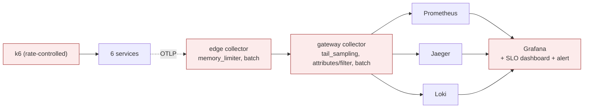

# ITER_04 — Hardening, SLOs & failure experiments

## §01 · Concept

> Unchanged — see SKELETON § 01.

## §02 · Architecture

Finalizes the telemetry pipeline into the edge→gateway shape that mirrors production and that the failure experiments exercise. No new business entities or routes. The edge collector stays lightweight; the gateway does the heavy processing (sampling, filtering, fan-out).



## §03 · Tech Stack

New/confirmed this iteration:
- **Collector pinned** to an `otelcol-contrib` version whose processor names match the configs below (`memory_limiter`, `batch`, `tail_sampling`, `attributes`, `filter`). The pin is recorded because processor config schemas drift across collector releases — an unpinned image is the most likely thing to break this stack months later.
- Prometheus **recording + alerting rules** (`deploy/prometheus/rules.yml`) for the SLO burn-rate alert; Alertmanager is intentionally *not* added — the alert is viewed in Prometheus/Grafana, keeping the MVP bounded (paging integrations are deferred).
- k6 scenarios (`constant-arrival-rate` plus a `ramping-arrival-rate` spike) for steady load and the backpressure experiment.

## §04 · Backend

**Collector topology.** `collector/edge.yaml`: OTLP receiver → `memory_limiter` → `batch` → OTLP exporter to the gateway. Processor order matters and is documented in the file: `memory_limiter` **first** so it can shed load before the batcher buffers it. `collector/gateway.yaml`: OTLP receiver → `memory_limiter` → `tail_sampling` → `attributes`/`filter` → `batch` → exporters (Jaeger OTLP, Prometheus, Loki OTLP).

**Tail-based sampling policy** (gateway): keep 100% of traces with an error status or duration over a threshold, and probabilistically sample a small percentage of the rest. Tail sampling (not head) is used specifically so the *decision* can see the whole trace — you keep every slow/failed order while shedding the boring majority. `decision_wait` must exceed the **full end-to-end trace duration**, which includes the async `PREP_SECONDS` delay from ITER_02 — otherwise the sampler decides before the fulfillment/notification spans arrive and persists incomplete traces (a failure that masquerades as a propagation bug). With `PREP_SECONDS=2`, `decision_wait: 15s` leaves comfortable margin:

```yaml
# collector/gateway.yaml (excerpt)
processors:
  tail_sampling:
    decision_wait: 15s        # must exceed end-to-end trace time incl. PREP_SECONDS
    policies:
      - name: errors
        type: status_code
        status_code: {status_codes: [ERROR]}
      - name: slow
        type: latency
        latency: {threshold_ms: 800}
      - name: sample-rest
        type: probabilistic
        probabilistic: {sampling_percentage: 5}
  attributes/scrub:
    actions:
      # Cost-trim genuinely noisy, low-value attributes — NOT brewline.order_id,
      # which ITER_03 deliberately keeps on spans for the log->trace pivot.
      - {key: http.request.header.user_agent, action: delete}
      - {key: net.sock.peer.addr, action: delete}
```

Note the scrub deliberately leaves `brewline.order_id` on spans: ITER_03 relies on it for the Loki→Jaeger lookup, so deleting it here would undo that. High-cardinality identifiers stay on spans (cheap, queryable per-trace); they are only ever banned from *metric* labels.

**SLOs** (Prometheus rules over ITER_03's metrics). The Prometheus exporter rewrites OTel metric names — dots become underscores and monotonic counters gain a `_total` suffix — so the rules must reference the *translated* series, not the OTel instrument names:
- *Latency*: 99% of `POST /orders` complete under 800ms, via `histogram_quantile(0.99, sum(rate(<duration_bucket_series>[5m])) by (le))`. The exact series name follows the pinned HTTP semantic-convention version (older instrumentation emits `http_server_duration_milliseconds_bucket`; current stable semconv emits `http_server_request_duration_seconds_bucket`) — pick one by pinning the instrumentation version, and make the threshold's unit match (800ms vs 0.8s). Either way this requires explicit bucket boundaries, so the order service is configured with a fixed-boundary (explicit-bucket) histogram view with a boundary at the SLO threshold — OTel's default histogram, or an exponential/native histogram, would not yield the `_bucket` series this query needs. The view config is pinned in the order service's telemetry setup.
- *Payment success*: `1 - (rate(brewline_payment_failures_total[5m]) / rate(brewline_orders_placed_total[5m])) >= 0.995` (note the `_total` suffixes the exporter adds to both counters).
- A multi-window burn-rate alert (`rules.yml`) fires when the error budget burns fast over a short and a long window simultaneously — the standard SRE pattern, made observable by dialing `PAYMENT_FAILURE_RATE` up.

**The four failure experiments** — each is wired to be induced via a flag/config and observed in an existing UI, then reverted. Runbooks live here:

1. **Broken trace context at the broker.** Set `BROKER_PROPAGATION=off` (read in `order/broker.py` and the consumers) to skip `inject`/`extract`. *Observe:* in Jaeger the order trace ends at the publish; fulfillment/notification appear as separate root traces. *Fix:* set it back to `on`; the waterfall reconnects. Teaches: header-carried context across non-HTTP boundaries.
2. **Metric cardinality explosion.** Set `CARDINALITY_MODE=high` so business metrics attach `order_id` as a label. *Observe:* Prometheus active series climbs without bound (`prometheus_tsdb_head_series`), scrape/memory grows. *Fix:* revert to `normal`; move `order_id` to spans/logs (already the default). Teaches: why identifiers belong on traces, not metrics.
3. **Collector backpressure.** Run the k6 `ramping-arrival-rate` spike against a deliberately weak edge config variant (`edge.weak.yaml`: tiny `memory_limiter`, no `batch`). *Observe:* the collector refuses/drops data; `otelcol_processor_refused_spans` and `otelcol_exporter_send_failed_spans` rise; gaps appear in Jaeger. *Fix:* swap back to `edge.yaml` with `memory_limiter` + `batch` sized correctly. Teaches: the collector as a choke point and how to size it.
4. **Sampling & cost.** Run with `tail_sampling` disabled vs enabled. *Observe:* compare the collector's own `otelcol_exporter_sent_spans` across the two runs to quantify the reduction from keeping errors/slow + 5% of the rest. (Don't lean on Jaeger storage as the yardstick — the all-in-one image stores traces in memory, so it's not a meaningful volume signal; the exporter counter is.) *Fix:* keep sampling on. Teaches: telemetry as a budgeted product.

**Sampling correctness boundary (noted, not built).** This tail-sampling setup is correct *only* because there is a single gateway instance, so every span of a given trace reaches the same collector and the decision sees the whole trace. The moment you run more than one gateway, spans for one trace can land on different collectors and sampling silently breaks — the fix is trace-ID-aware routing via the `loadbalancing` exporter in front of the gateway tier. The MVP stays single-gateway; this is flagged as a known scaling edge (and is exactly the kind of operational nuance worth a writeup).

Each runbook is a short, repeatable sequence (set flag → drive k6 → screenshot the named metric/trace → revert), which doubles as the portfolio writeup material.

No new application env vars beyond the experiment flags `BROKER_PROPAGATION` (default `on`) and `CARDINALITY_MODE` (default `normal`).

## §05 · Frontend

One new Grafana dashboard plus the load generator graduates to rate control:

- **SLO & error budget** dashboard (`/d/brewline-slo`) — request-success SLI vs target, remaining error budget, and burn-rate panels for the latency and payment-success SLOs, with the alert state surfaced. Empty/no-data states reuse ITER_03's conventions.
- `loadgen/k6_order.js` gains two scenarios: a steady `constant-arrival-rate` baseline and a `ramping-arrival-rate` spike used by experiment #3, selectable via a k6 env var. This is the only "client" surface; still no bespoke SPA (deliberate, per SKELETON § 05).

## Out of MVP scope

- LLM-backed "where's my order?" support agent instrumented with the GenAI semantic conventions (the natural v2 / alternative-2 bolt-on).
- A real human-facing storefront SPA beyond the k6 / curl client.
- Authentication, authorization, and multi-tenancy.
- Real payment-provider integration (the MVP uses a stateless simulator).
- Kubernetes deployment and DaemonSet-based edge collectors (the MVP uses Docker Compose with per-service agents).
- High-availability / clustered broker and backends; long-horizon storage backends (Tempo, Mimir).
- Continuous profiling (pprof / eBPF) and the OTel logs-from-files collection path.
- Alertmanager/paging integrations beyond an in-Prometheus burn-rate alert.
- CI/CD pipeline.
