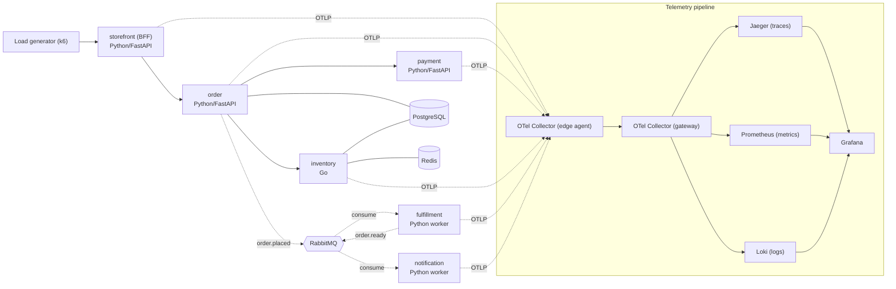

# SKELETON — Brewline

## §01 · Concept

Brewline is a deliberately small coffee-order backend whose real purpose is to be a teaching rig for OpenTelemetry. A customer places an order; the order is validated, charged, stock-checked, then handed off asynchronously to a kitchen worker that marks it ready and notifies the customer. The point isn't the coffee — it's that a single order becomes one distributed trace that crosses synchronous HTTP calls *and* an asynchronous message broker, plus the metrics, logs, SLOs, and failure modes that come with running it. The single most important flow: `POST /orders` on the storefront produces one connected trace spanning all six services and visible end-to-end in Jaeger.

## §02 · Architecture



Solid edges are synchronous HTTP (W3C `traceparent` propagates automatically once instrumented). Dashed broker edges are where trace context must be propagated by hand — wired for real in ITER_02.

**Data model** (full target shape stated upfront; implementations stubbed at skeleton stage):

- `Order` — `id` (uuid, pk), `status` (enum: `placed` | `paid` | `fulfilling` | `ready` | `failed`), `total_amount` (numeric), `currency` (char(3), default `USD`), `payment_ref` (text, nullable), `created_at` (timestamptz), `updated_at` (timestamptz). Owned by the **order** service.
- `OrderItem` — `id` (uuid, pk), `order_id` (uuid, fk → Order), `sku` (text), `name` (text), `qty` (int), `unit_price` (numeric). Owned by the **order** service.
- `InventoryItem` — `sku` (text, pk), `name` (text), `available_qty` (int), `reserved_qty` (int, default 0), `updated_at` (timestamptz). Owned by the **inventory** service.

Payment is stateless — no table; it returns a result and a `payment_ref` string. No `User`/auth tables (single trusted caller in the MVP; auth is deferred).

**API surface** (method · path · description · stub return shape):

- storefront (public BFF)
  - `POST /orders` — place an order; forwards to order service → `202 {"order_id": uuid, "status": "placed"}`
  - `GET /orders/{id}` — fetch order status → `200 {"order_id": uuid, "status": str, "items": [...]}`
  - `GET /healthz` → `200 {"ok": true}`
- order
  - `POST /orders` — validate, persist, call payment + inventory, publish `order.placed` → `202 {"order_id": uuid, "status": "placed"}`
  - `GET /orders/{id}` → `200 {"order_id": uuid, "status": str, "total_amount": str, "items": [...]}`
  - `GET /healthz` → `200 {"ok": true}`
- payment
  - `POST /charge` — body `{"order_id": uuid, "amount": str, "currency": str}` → `200 {"status": "approved"|"declined", "payment_ref": str|null}`
  - `GET /healthz` → `200 {"ok": true}`
- inventory (Go)
  - `POST /reserve` — body `{"order_id": uuid, "items": [{"sku": str, "qty": int}]}` → `200 {"reserved": bool, "shortages": [{"sku": str, "short_by": int}]}`
  - `GET /inventory/{sku}` → `200 {"sku": str, "available_qty": int}`
  - `GET /healthz` → `200 {"ok": true}`
- fulfillment — no HTTP surface beyond `GET /healthz`; consumes `order.placed`, publishes `order.ready`
- notification — no HTTP surface beyond `GET /healthz`; consumes `order.ready`

Messaging (RabbitMQ, topic exchange `brewline`):
- `order.placed` — published by order, consumed by fulfillment. Body: `{"order_id": uuid}`.
- `order.ready` — published by fulfillment, consumed by notification. Body: `{"order_id": uuid}`.

Cross-origin/auth: the only HTTP client is the internal load generator and service-to-service calls, all on the compose network. No browser CORS surface and no auth in the MVP — both explicitly deferred (see terminator's Out of MVP scope).

## §03 · Tech Stack

- **Python services** (storefront, order, payment, fulfillment, notification): Python 3.12, FastAPI + Uvicorn for HTTP; `httpx` for outbound calls; `aio-pika` for RabbitMQ; SQLAlchemy 2.x (async, `asyncpg`) for the order service's DB access.
- **Go service** (inventory): Go 1.22, `net/http` with `chi` router; `pgx` for Postgres; `go-redis` for the cache.
- **Datastores**: PostgreSQL 16 (single instance, table ownership split by service); Redis 7 (inventory cache); RabbitMQ 3.13 (broker).
- **Telemetry**: `opentelemetry-distro` + `opentelemetry-instrumentation-*` (FastAPI, httpx, asyncpg/SQLAlchemy, aio-pika, redis, logging) for Python; `go.opentelemetry.io/otel` + contrib instrumentation for Go. Exporter: OTLP/gRPC.
- **Collector & backends**: `otel/opentelemetry-collector-contrib`; Jaeger (OTLP-native ingest); Prometheus; Loki 3.x (OTLP ingest); Grafana with Jaeger/Prometheus/Loki datasources.
- **Orchestration**: Docker Compose. Version pinning is deferred to the iteration where a version actually matters (collector processor names and Loki OTLP are the likely pin points — pinned in ITER_04 / ITER_03 respectively).

## §04 · Backend

Monorepo layout (2–3 levels):

```
brewline/
  services/
    storefront/      app.py  requirements.txt  Dockerfile
    order/           app/{main.py,db.py,models.py,broker.py}  alembic/  requirements.txt  Dockerfile
    payment/         app.py  requirements.txt  Dockerfile
    fulfillment/     worker.py  requirements.txt  Dockerfile
    notification/    worker.py  requirements.txt  Dockerfile
    inventory/       main.go  go.mod  Dockerfile
  collector/
    edge.yaml        gateway.yaml
  deploy/
    docker-compose.yml
    grafana/{datasources.yaml,dashboards/}
    prometheus/prometheus.yml
    loki/loki-config.yaml
    db/inventory_init.sql
  loadgen/           k6_order.js
```

Representative stub (storefront — shows the pattern; all skeleton handlers return concrete fake data, no logic yet):

```python
# services/storefront/app.py
import os, httpx
from fastapi import FastAPI
from pydantic import BaseModel

ORDER_URL = os.environ["ORDER_URL"]
app = FastAPI()

class Item(BaseModel):
    sku: str; name: str; qty: int; unit_price: str

class OrderIn(BaseModel):
    items: list[Item]

@app.get("/healthz")
async def healthz():
    return {"ok": True}

@app.post("/orders", status_code=202)
async def place_order(_: OrderIn):
    # SKELETON: return a fixed stub; real forwarding lands in ITER_01
    return {"order_id": "00000000-0000-0000-0000-000000000000", "status": "placed"}

@app.get("/orders/{order_id}")
async def get_order(order_id: str):
    return {"order_id": order_id, "status": "placed", "items": []}
```

Representative Go stub (inventory):

```go
// services/inventory/main.go
package main

import ("encoding/json"; "net/http"; "github.com/go-chi/chi/v5")

func main() {
    r := chi.NewRouter()
    r.Get("/healthz", func(w http.ResponseWriter, _ *http.Request) {
        json.NewEncoder(w).Encode(map[string]bool{"ok": true})
    })
    r.Post("/reserve", func(w http.ResponseWriter, _ *http.Request) {
        // SKELETON: always reserves; real stock logic lands in ITER_01
        json.NewEncoder(w).Encode(map[string]any{"reserved": true, "shortages": []any{}})
    })
    http.ListenAndServe(":8080", r)
}
```

OpenTelemetry at skeleton stage: every Python service starts under `opentelemetry-instrument` (zero-code auto-instrumentation) and the Go service initializes a tracer provider in `main`, both exporting OTLP to the edge collector. This means even stubbed requests already emit a (shallow) trace, so the pipeline is provably working before any business logic exists.

Run locally (single command): `docker compose -f deploy/docker-compose.yml up --build`. Brings up the six services, Postgres/Redis/RabbitMQ, both collectors, and Jaeger/Prometheus/Loki/Grafana.

Environment variables (names only): `ORDER_URL`, `PAYMENT_URL`, `INVENTORY_URL`, `DATABASE_URL`, `REDIS_URL`, `RABBITMQ_URL`, `OTEL_EXPORTER_OTLP_ENDPOINT`, `OTEL_SERVICE_NAME`, `OTEL_RESOURCE_ATTRIBUTES`.

## §05 · Frontend

There is no bespoke single-page app — that would add surface area without teaching anything about OpenTelemetry. The operator-facing "frontend" is the observability layer, and the order-placing "client" is a load generator. This is a deliberate architectural choice, restated wherever §05 is touched.

Surfaces ("screens") and their routes:
- **Grafana** (`http://localhost:3000`) — the primary UI. Datasources for Jaeger, Prometheus, and Loki are provisioned from `deploy/grafana/datasources.yaml`. Dashboards are added in later iterations; the skeleton ships an empty "Brewline" folder so the provisioning path is proven.
- **Jaeger UI** (`http://localhost:16686`) — trace search and waterfall view.
- **RabbitMQ management** (`http://localhost:15672`) — queue depth eyeball during async work.

Client / "how orders get placed":
- `loadgen/k6_order.js` — a k6 script that POSTs to the storefront. At skeleton stage it fires a handful of requests so the pipeline lights up; it grows into a rate-controlled generator in ITER_04.

Run locally: the UIs come up with `docker compose up`; drive traffic with `k6 run loadgen/k6_order.js` (or `curl` against `http://localhost:8000/orders`).

Placeholder data strategy: skeleton handlers return concrete, schema-valid stub payloads (fixed UUID, empty item lists), so the UI surfaces and the telemetry pipeline render real (if shallow) data immediately. Each iteration replaces stubs with real logic behind the same shapes.
