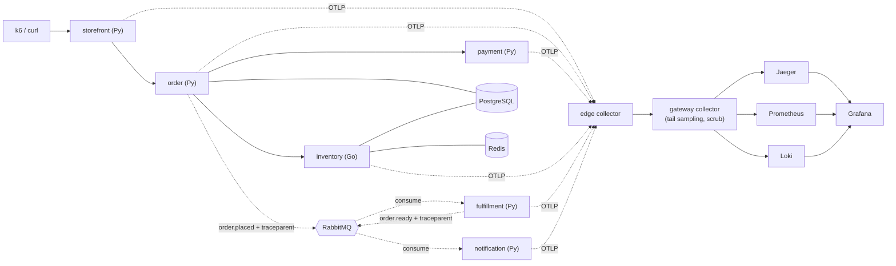

# Brewline Guide

Brewline is a **teaching rig for OpenTelemetry**. It is a small but realistic coffee
order-and-fulfillment backend whose only real job is to make OpenTelemetry concrete:
one `POST /orders` becomes a single distributed trace that crosses synchronous HTTP
calls *and* an asynchronous message broker, accompanied by the metrics, logs, SLOs,
and failure modes you get when you actually run a distributed system.

You are both the **user** (you place orders and explore the telemetry to learn) and
the **operator** (you stand the stack up and run the experiments). This guide keeps
those hats separate: learning tasks live in *Getting started*, *Concepts*, and
*How-to*; running-the-system tasks live under *Operations* and *Experiments*.

## What this rig teaches

Brewline is built so that each OpenTelemetry idea is demonstrated by a real moving
part you can see, break, and fix:

- **One trace across sync + async boundaries** — HTTP context propagates
  automatically; broker context is propagated by hand. See [Concepts](concepts.md).
- **Cross-language propagation** — the order→inventory hop crosses Python→Go, where
  the Go SDK's default no-op propagator is a classic silent trace-breaker.
- **The three pillars** — traces (Jaeger), metrics (Prometheus), logs (Loki), all
  shipped over OTLP through an edge→gateway collector pipeline and viewed in Grafana.
- **Trace-correlated logs** — pivot from a slow trace to its exact log lines.
- **Metrics discipline** — RED metrics plus business metrics, and why high-cardinality
  identifiers belong on traces, not metric labels.
- **Collector as a product** — tail sampling, attribute scrubbing, memory limiting,
  and what happens when the collector is undersized.
- **SLOs and burn-rate alerting** — latency and payment-success SLOs with a
  multi-window burn-rate alert.

The deepest learning is in the four **experiments**: each one has you toggle a flag,
break the telemetry on purpose, observe the symptom in a real UI, and fix it.

## Architecture

For the full diagram set — system context, sequence diagrams, data model, order state
machine — plus the decision trail behind the design, see
[`.agents_workspace/ARCHITECTURE.md`](../../.agents_workspace/ARCHITECTURE.md).

## Contents

### Start here

| Page | Read this when |
|---|---|
| [Getting started](getting-started.md) | You have an empty checkout and want your first trace in Jaeger. |
| [Concepts](concepts.md) | You have seen a trace and want to know what you were looking at. |
| [Troubleshooting](troubleshooting.md) | Something is empty, missing, or failing and you did not do it on purpose. |

### How-to — learning tasks (user)

You need only a browser, `curl`, and a stack someone has started. These pages are
read-only: none of them asks you to change configuration.

| Page | Read this when |
|---|---|
| [HT-01 — Observe traces](how-to/HT-01-observe-traces.md) | You want to read an order waterfall in Jaeger and recognize every hop. |
| [HT-02 — Observe metrics and logs](how-to/HT-02-observe-metrics-and-logs.md) | You want the Grafana dashboards, and the log→trace pivot. |
| [HT-03 — SLOs and burn-rate alerts](how-to/HT-03-slos-and-alerts.md) | You want to know what the two SLOs measure and exactly when the alert fires. |

### Operations — running the system (operator)

These pages assume shell access to the repo, permission to edit `.env` and
`deploy/docker-compose.yml`, and permission to recreate containers.

| Page | Read this when |
|---|---|
| [OP-01 — Install and configure](operations/OP-01-install-and-configure.md) | You are standing the stack up, or you need the meaning and range of a setting. |
| [OP-02 — Runbook](operations/OP-02-runbook.md) | You are starting, stopping, monitoring, or recovering the stack. |
| [OP-03 — SLO alert drill](operations/OP-03-slo-alert-drill.md) | You want to prove the alerting path works before trusting it. |

### Experiments — deliberate-failure labs (operator)

The heart of the rig. Each lab follows the same loop:

> **set a flag → drive load → observe the symptom in a real UI → revert the fix**

Each lab is independently runnable and fully reversible. Run them in any order, but
EX-01 and EX-02 (environment-flag toggles) are the gentlest starting point; EX-03 and
EX-04 (collector config swaps) go deeper into the pipeline. Always revert at the end of
a lab so the next one starts from a healthy baseline.

| Page | Toggle | Read this when |
|---|---|---|
| [EX-01 — Broken trace context at the broker](experiments/EX-01-broken-broker-context.md) | `BROKER_PROPAGATION` | You want to see context propagation fail across a non-HTTP boundary. |
| [EX-02 — Metric cardinality explosion](experiments/EX-02-metric-cardinality.md) | `CARDINALITY_MODE` | You want to watch one careless label grow a Prometheus without bound. |
| [EX-03 — Collector backpressure](experiments/EX-03-collector-backpressure.md) | `edge.weak.yaml` | You want to see the collector become the choke point under a spike. |
| [EX-04 — Sampling and cost](experiments/EX-04-sampling-and-cost.md) | `gateway.nosample.yaml` | You want to measure what tail sampling actually saves. |

The two toggle mechanisms are documented once, in
[OP-01 — Install and configure](operations/OP-01-install-and-configure.md): environment
flags under *Behavior / experiment knobs*, and collector config swaps under *Collector
configs*.

## Naming and reading order

File names carry their reading order. Pages at the root of this guide are unnumbered
and can be read in any order. Every page inside a subfolder is
`<PREFIX>-<NN>-<name>.md`, where the prefix names the subfolder (`HT` = how-to,
`OP` = operations, `EX` = experiments) and `NN` is the order to read them in. Each
subfolder is its own chain, so `HT-01` and `OP-01` are unrelated; the prev/next links
at the foot of each page stay inside one subfolder.

## Service and port map

| Service | Language | Purpose | Local URL |
|---|---|---|---|
| storefront | Python/FastAPI | Public BFF, forwards to order | http://localhost:8000 |
| order | Python/FastAPI | Persist, charge, reserve, publish `order.placed` | http://localhost:8001 |
| payment | Python/FastAPI | Charge simulator (tunable failure/latency) | http://localhost:8002 |
| inventory | Go/chi | Stock reservation, Redis cache | http://localhost:8080 |
| fulfillment | Python worker | Consumes `order.placed` → `order.ready` | (no public HTTP) |
| notification | Python worker | Consumes `order.ready` | (no public HTTP) |

| Telemetry UI | Local URL | Notes |
|---|---|---|
| Grafana | http://localhost:3000 | Anonymous admin enabled |
| Jaeger | http://localhost:16686 | Trace search + waterfall |
| Prometheus | http://localhost:9090 | Metrics, rules, alerts |
| RabbitMQ management | http://localhost:15672 | Login `brewline` / `brewline` |

## Glossary

- **Span** — one timed operation (an HTTP handler, a DB query, a publish). Spans
  nest to form a trace.
- **Trace** — the tree of spans for one logical request, sharing a trace ID.
- **`traceparent`** — the W3C header that carries trace context between services.
- **Propagator** — the component that reads/writes `traceparent` into a carrier
  (HTTP headers, AMQP message headers).
- **OTLP** — OpenTelemetry Protocol; how services ship telemetry to the collector.
- **Collector** — a pipeline (receive → process → export) that sits between your
  services and the backends. Brewline runs an *edge* and a *gateway* collector.
- **Tail sampling** — deciding whether to keep a trace *after* seeing all its spans
  (so you can always keep errors and slow traces).
- **RED metrics** — Rate, Errors, Duration per service.
- **Cardinality** — the number of distinct label combinations on a metric; high
  cardinality is the main way metrics blow up cost.
- **SLI / SLO / error budget** — the indicator you measure, the target you promise,
  and how much failure the target permits.
