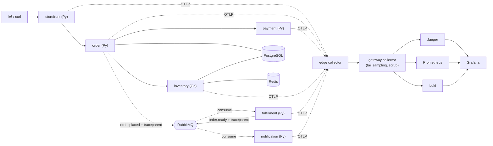

# Brewline Guide

Brewline is a **teaching rig for OpenTelemetry**. It is a small but realistic coffee
order-and-fulfillment backend whose only real job is to make OpenTelemetry concrete:
one `POST /orders` becomes a single distributed trace that crosses synchronous HTTP
calls *and* an asynchronous message broker, accompanied by the metrics, logs, SLOs,
and failure modes you get when you actually run a distributed system.

You are both the **user** (you place orders and explore the telemetry to learn) and
the **operator** (you stand the stack up and run the experiments). This guide keeps
those hats separate: learning tasks live in *Getting started*, *Concepts*, *How-to*,
and *Experiments*; running-the-system tasks live under *Operations*.

## What this rig teaches

Brewline is built so that each OpenTelemetry idea is demonstrated by a real moving
part you can see, break, and fix:

- **One trace across sync + async boundaries** — HTTP context propagates
  automatically; broker context is propagated by hand. See [Concepts](concepts.md).
- **Cross-language propagation** — the order→inventory hop crosses Python→Go, where
  the Go SDK's default no-op propagator is a classic silent trace-breaker.
- **The three pillars** — traces (Jaeger), metrics (Prometheus), logs (Loki), all
  shipped over OTLP through an edge→gateway collector pipeline and viewed in Grafana.
- **Trace-correlated logs** — pivot from a slow trace to its exact log lines.
- **Metrics discipline** — RED metrics plus business metrics, and why high-cardinality
  identifiers belong on traces, not metric labels.
- **Collector as a product** — tail sampling, attribute scrubbing, memory limiting,
  and what happens when the collector is undersized.
- **SLOs and burn-rate alerting** — latency and payment-success SLOs with a
  multi-window burn-rate alert.

The deepest learning is in the four **[Experiments](experiments/index.md)**: each one
has you toggle a flag, break the telemetry on purpose, observe the symptom in a real
UI, and fix it.

## Architecture

For the full diagram set — system context, sequence diagrams, data model, order state
machine — plus the decision trail behind the design, see
[`.agents_workspace/ARCHITECTURE.md`](../../.agents_workspace/ARCHITECTURE.md).

## Contents

- **[Getting started](getting-started.md)** — from an empty checkout to your first
  trace in Jaeger.
- **[Concepts](concepts.md)** — the OpenTelemetry ideas this rig demonstrates and
  where each one lives in the code.
- **How-to**
  - [Observe traces](how-to/observe-traces.md)
  - [Observe metrics and logs](how-to/observe-metrics-and-logs.md)
  - [SLOs and burn-rate alerts](how-to/slos-and-alerts.md)
- **[Experiments](experiments/index.md)** — four deliberate-failure labs (the heart
  of the rig).
- **Operations**
  - [Install and configure](operations/install-and-configure.md)
  - [Runbook](operations/runbook.md)
- **[Troubleshooting](troubleshooting.md)**

## Service and port map

| Service | Language | Purpose | Local URL |
|---|---|---|---|
| storefront | Python/FastAPI | Public BFF, forwards to order | http://localhost:8000 |
| order | Python/FastAPI | Persist, charge, reserve, publish `order.placed` | http://localhost:8001 |
| payment | Python/FastAPI | Charge simulator (tunable failure/latency) | http://localhost:8002 |
| inventory | Go/chi | Stock reservation, Redis cache | http://localhost:8080 |
| fulfillment | Python worker | Consumes `order.placed` → `order.ready` | (no public HTTP) |
| notification | Python worker | Consumes `order.ready` | (no public HTTP) |

| Telemetry UI | Local URL | Notes |
|---|---|---|
| Grafana | http://localhost:3000 | Anonymous admin enabled |
| Jaeger | http://localhost:16686 | Trace search + waterfall |
| Prometheus | http://localhost:9090 | Metrics, rules, alerts |
| RabbitMQ management | http://localhost:15672 | Login `brewline` / `brewline` |

## Glossary

- **Span** — one timed operation (an HTTP handler, a DB query, a publish). Spans
  nest to form a trace.
- **Trace** — the tree of spans for one logical request, sharing a trace ID.
- **`traceparent`** — the W3C header that carries trace context between services.
- **Propagator** — the component that reads/writes `traceparent` into a carrier
  (HTTP headers, AMQP message headers).
- **OTLP** — OpenTelemetry Protocol; how services ship telemetry to the collector.
- **Collector** — a pipeline (receive → process → export) that sits between your
  services and the backends. Brewline runs an *edge* and a *gateway* collector.
- **Tail sampling** — deciding whether to keep a trace *after* seeing all its spans
  (so you can always keep errors and slow traces).
- **RED metrics** — Rate, Errors, Duration per service.
- **Cardinality** — the number of distinct label combinations on a metric; high
  cardinality is the main way metrics blow up cost.
- **SLI / SLO / error budget** — the indicator you measure, the target you promise,
  and how much failure the target permits.
